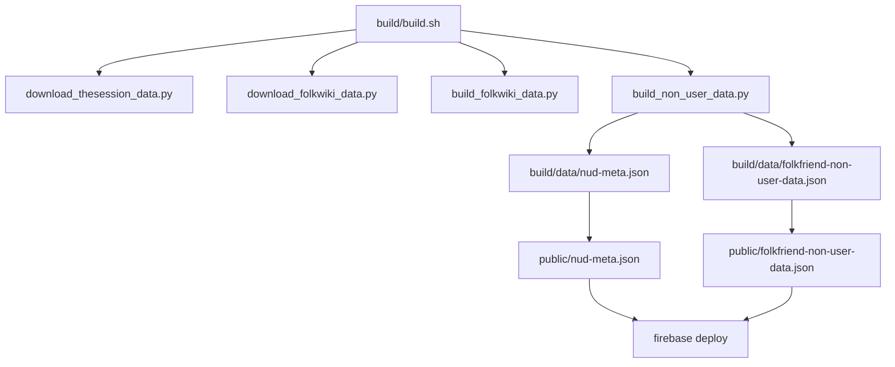

# FolkFriend App Data Pipeline

This document focuses on the `folkfriend-app-data` repository: what it stores, what the build does, and how its outputs reach the FolkFriend app.

For the broader end-to-end system, see:

- `folkfriend/docs/system-architecture.md`

## Purpose

`folkfriend-app-data` is the offline build-and-publish repository for FolkFriend tune data.

It does not serve the user interface. Its job is to:

- fetch tune source data
- transform it into the app’s internal schema
- precompute MIDI contour information
- publish a static JSON bundle for browser use

## Repository Layout

Important paths:

- `build/build.sh`
- `build/src/download_thesession_data.py`
- `build/src/download_folkwiki_data.py`
- `build/src/build_folkwiki_data.py`
- `build/src/build_non_user_data.py`
- `build/src/midi.py`
- `public/folkfriend-non-user-data.json`
- `public/nud-meta.json`
- `firebase.json`

## Data Sources

### TheSession

Downloaded from:

- `https://raw.githubusercontent.com/adactio/TheSession-data/main/json/tunes.json`
- `https://raw.githubusercontent.com/adactio/TheSession-data/main/json/aliases.json`

Stored locally as:

- `build/data/tunes.json`
- `build/data/aliases.json`

### Folkwiki

Discovered and downloaded from:

- Wayback CDX API for URL discovery
- live `folkwiki.se/pub/cache/*.abc` files for content

Stored locally as:

- `build/data/folkwiki/manifest.json`
- `build/data/folkwiki/*.abc`

## Build Pipeline



### Stage 1: Download TheSession

Script:

- `build/src/download_thesession_data.py`

Outputs:

- `build/data/tunes.json`
- `build/data/aliases.json`

### Stage 2: Download Folkwiki

Script:

- `build/src/download_folkwiki_data.py`

Outputs:

- `build/data/folkwiki/manifest.json`
- `build/data/folkwiki/*.abc`

Notes:

- discovery is broader than the currently usable subset
- some discovered cache URLs may 404 and are skipped

### Stage 3: Build Folkwiki Processed Data

Script:

- `build/src/build_folkwiki_data.py`

Outputs:

- `build/data/folkwiki-processed.json`
- `build/data/folkwiki/midis/*.midi`

This stage:

- parses ABC tune blocks
- normalizes core metadata
- assigns reserved Folkwiki tune and setting ID ranges
- converts ABC to MIDI
- derives contour strings

### Stage 4: Build Merged Non-User Data

Script:

- `build/src/build_non_user_data.py`

Outputs:

- `build/data/folkfriend-non-user-data.json`
- `build/data/nud-meta.json`

This stage:

- cleans and condenses TheSession records
- merges TheSession and Folkwiki settings
- merges alias data
- writes the final runtime bundle
- records bundle version/size metadata

## MIDI Conversion

MIDI generation is handled by:

- `build/src/midi.py`
- local `abc2midi`

This work happens only at build time.

The browser does not run `abc2midi`.

## Local Storage During Builds

The build cache and intermediates live under `build/data/`.

Key files:

- `tunes.json`
- `aliases.json`
- `folkwiki/manifest.json`
- `folkwiki/*.abc`
- `folkwiki/midis/*.midi`
- `folkwiki-processed.json`
- `folkfriend-non-user-data.json`
- `nud-meta.json`

These are a mix of:

- upstream raw downloads
- derived intermediate artifacts
- final generated outputs

## Published Outputs

The final public artifacts are:

- `public/folkfriend-non-user-data.json`
- `public/nud-meta.json`

These are deployed via Firebase Hosting and consumed by the `folkfriend` app.

Production endpoint:

- `https://folkfriend-data.web.app/`

## Output JSON Schema

The main published file is:

- `public/folkfriend-non-user-data.json`

Its top-level structure is:

```json
{
  "settings": {
    "SETTING_ID": { "...": "..." }
  },
  "aliases": {
    "TUNE_ID": ["alias 1", "alias 2"]
  }
}
```

### Root Keys

- `settings`
  Map of `setting_id -> setting object`
- `aliases`
  Map of `tune_id -> alias list`

### `aliases`

Each entry is a list of strings:

- first alias is the canonical/preferred display name
- remaining aliases are alternate names used for matching and display

Example:

```json
{
  "15326": [
    "example primary name",
    "example alternate name"
  ]
}
```

### `settings`

Each setting object describes one tune setting/version.

Fields common to all settings:

- `tune_id`
  Tune identifier as a string
- `meter`
  Time signature, e.g. `"4/4"`
- `mode`
  Normalized key/mode string, e.g. `"Gmajor"` or `"Ddorian"`
- `abc`
  ABC notation body used for rendering and display
- `dance`
  Type/rhythm label
- `contour`
  Precomputed contour string used by query/search
- `origin`
  Region/source string; empty for many TheSession records, often populated for Folkwiki

TheSession-only field currently present:

- `composer`

Folkwiki-only field currently present:

- `source_url`

### TheSession Setting Example

```json
{
  "tune_id": "15326",
  "meter": "4/4",
  "mode": "Gmajor",
  "abc": "|:G>A B>G c>A B>G|...",
  "composer": "",
  "dance": "strathspey",
  "contour": "ttxxyyxxqqqvvoooo...",
  "origin": ""
}
```

### Folkwiki Setting Example

```json
{
  "tune_id": "1000000",
  "meter": "3/4",
  "mode": "Gmajor",
  "abc": "gg/f/ gb ag|...",
  "dance": "polska",
  "origin": "Verkelbäck, Småland",
  "source_url": "http://www.folkwiki.se/pub/cache/Polska_ur_Petter_Dufvas_notbok_Ma625_000f8d.abc",
  "contour": "FFFJHFEEAAxxox..."
}
```

### ID Conventions

- `setting_id` is the JSON key in `settings`, not a nested field
- `tune_id` is stored inside each setting object
- IDs are encoded as strings

### Current Schema Variants In Production Data

Today there are two dominant setting shapes:

1. TheSession settings:
   - `abc`, `composer`, `contour`, `dance`, `meter`, `mode`, `origin`, `tune_id`

2. Folkwiki settings:
   - `abc`, `contour`, `dance`, `meter`, `mode`, `origin`, `source_url`, `tune_id`

## Deployment Behavior

The main pipeline entrypoint is:

```bash
cd build
./build.sh
```

The script currently:

1. checks `abc2midi`
2. downloads TheSession data
3. hashes the downloaded TheSession inputs
4. exits early if TheSession has not changed
5. otherwise refreshes Folkwiki data
6. rebuilds the merged JSON outputs
7. copies outputs to `public/`
8. commits generated files
9. pushes the repo
10. deploys to Firebase

## Connection To The App

The `folkfriend` app loads the hosted data bundle from:

- `https://folkfriend-data.web.app/nud-meta.json`
- `https://folkfriend-data.web.app/folkfriend-non-user-data.json`

In development, the app can instead use local `/res/...` files.

The app:

- downloads the published JSON
- caches it in IndexedDB
- passes the compact queryable portion into WASM
- keeps ABC text and source URLs in the worker for UI rendering

## Current Operational Risks

This is still PoC infrastructure, so a few characteristics are worth noting:

- Folkwiki discovery returns some stale cache URLs
- some Folkwiki ABC files are unparseable and skipped
- MIDI conversion can be expensive and source-quality-dependent
- the app depends on one relatively large static bundle

## Related Files

- `build/build.sh`
- `build/src/*.py`
- `public/folkfriend-non-user-data.json`
- `public/nud-meta.json`
- `test/smoke_test.py`
